# xsukax ClamAV Scanner

[](https://xsukax.github.io/xsukax-ClamAV-Scanner)
[](LICENSE)
[](https://www.clamav.net/)

A powerful, privacy-focused browser-based antivirus scanner powered by official ClamAV virus databases. Scan files for malware directly in your web browser with **zero server uploads** – all processing happens locally on your device.

**🔗 Live Demo:** [https://xsukax.github.io/xsukax-ClamAV-Scanner](https://xsukax.github.io/xsukax-ClamAV-Scanner)

---

## 📋 Project Overview

xsukax ClamAV Scanner is a client-side web application that brings the trusted ClamAV antivirus engine directly to your browser. Unlike traditional antivirus solutions that require software installation or cloud uploads, this scanner operates entirely within your web browser using JavaScript and Web APIs.

The application leverages official ClamAV CVD (ClamAV Virus Database) files maintained by Cisco Talos, providing access to millions of malware signatures including viruses, trojans, worms, ransomware, and other threats. By utilizing hash-based detection methods (MD5, SHA1, SHA256), it can identify known malicious files quickly and efficiently without requiring complex pattern matching or behavioral analysis.

### Key Capabilities

- **Database Management**: Load and parse official ClamAV CVD/CLD files containing millions of virus signatures
- **Multi-File Scanning**: Scan single or multiple files simultaneously with real-time progress tracking
- **Hash-Based Detection**: Utilizes MD5, SHA1, and SHA256 cryptographic hashes for precise malware identification
- **CVD Extraction**: Automatically extracts and processes compressed TAR.GZ archives within CVD containers
- **Comprehensive Results**: Detailed scan reports showing threat names, database sources, and detection methods
- **Modern Interface**: Intuitive, responsive design with real-time statistics and visual feedback

---

## 🔒 Security and Privacy Benefits

xsukax ClamAV Scanner is architected with privacy and security as foundational principles, ensuring users maintain complete control over their data throughout the scanning process.

### Complete Client-Side Processing

All file analysis, hash computation, and malware detection operations execute entirely within the user's browser. No files, file contents, hashes, or metadata are ever transmitted to external servers, third-party services, or remote endpoints. This architecture eliminates the risks associated with cloud-based scanning services, including data interception, unauthorized access, and privacy breaches.

### Zero Data Collection

The application neither collects, stores, nor transmits any user data, scan results, or analytical information. There are no tracking mechanisms, analytics services, or telemetry systems integrated into the codebase. Users can verify this commitment by inspecting the transparent, open-source code.

### Official Signature Databases

The scanner exclusively utilizes authentic ClamAV virus databases distributed by Cisco Talos through official channels (`database.clamav.net`). These databases undergo rigorous verification processes and are digitally signed to prevent tampering. Users download databases directly from ClamAV's official infrastructure, ensuring signature authenticity and integrity.

### Cryptographic Integrity

File scanning employs industry-standard cryptographic hash functions:
- **MD5**: Legacy support for compatibility with older signature databases
- **SHA-1**: Widely adopted hash algorithm for malware identification
- **SHA-256**: Modern, cryptographically secure hash function resistant to collision attacks

These hashing operations occur locally using the browser's native Web Crypto API and trusted JavaScript libraries (CryptoJS), ensuring computational integrity without external dependencies.

### Transparent Open Source

The entire application source code is publicly accessible on GitHub, enabling security researchers, developers, and privacy advocates to audit, verify, and contribute to the project. This transparency fosters trust and allows the community to identify and address potential vulnerabilities collaboratively.

### No Server Requirements

As a static HTML application, xsukax ClamAV Scanner requires no backend infrastructure, databases, or server-side processing. This architecture eliminates entire categories of security vulnerabilities including SQL injection, server-side code execution, authentication bypasses, and data breaches associated with server compromise.

### Offline Capability

Once the application page is loaded and virus databases are downloaded, users can operate the scanner without an active internet connection. Files can be scanned in air-gapped environments or on systems with restricted network access, providing security benefits for sensitive operational contexts.

---

## ✨ Features and Advantages

### Core Functionality

- **🛡️ Official ClamAV Integration**: Supports main.cvd and daily.cvd databases containing approximately 7 million combined signatures
- **📦 Automatic CVD Extraction**: Seamlessly decompresses and parses GZIP-compressed TAR archives within CVD containers
- **🔍 Multi-Hash Detection**: Employs MD5, SHA1, and SHA256 hash matching for comprehensive threat identification
- **📊 Real-Time Statistics**: Live dashboard displaying loaded databases, signature counts, scan progress, and detection rates
- **🎯 Detailed Threat Reporting**: Identifies specific malware names, source databases, and matched hash types for detected threats
- **⚡ Batch Scanning**: Process multiple files simultaneously with asynchronous operations for optimal performance
- **💾 No Installation Required**: Runs directly in any modern web browser without plugins, extensions, or software installation

### User Experience

- **🎨 Modern Interface**: Gradient-enhanced, responsive design optimized for desktop and mobile devices
- **🔄 Drag-and-Drop Support**: Intuitive file selection via drag-and-drop or traditional file browser
- **📈 Progress Tracking**: Visual progress bars and status indicators for long-running operations
- **🔔 Smart Notifications**: Toast-style notifications for operation success, warnings, and errors
- **📋 Database Viewer**: Inspect loaded databases, signature counts, extracted files, and source information
- **🗑️ Easy Management**: Clear scan results or remove databases with single-click actions

### Technical Advantages

- **Zero Latency**: No network round-trips for file uploads; instant hash computation and comparison
- **Unlimited File Size**: No server-imposed file size restrictions (limited only by browser memory)
- **Privacy by Design**: Architecture fundamentally prevents data leakage or unauthorized access
- **Cross-Platform**: Compatible with Windows, macOS, Linux, and mobile operating systems
- **No Dependencies**: Self-contained HTML file with CDN-hosted libraries (Tailwind CSS, Pako, CryptoJS)
- **Extensible**: Modular JavaScript architecture facilitates future enhancements and custom integrations

### Comparison with Traditional Solutions

| Feature | xsukax ClamAV Scanner | Cloud-Based Scanners | Desktop Antivirus |
|---------|----------------------|---------------------|-------------------|
| Privacy | ✅ Complete | ❌ Files uploaded | ⚠️ Varies |
| Installation | ✅ None required | ✅ Browser only | ❌ Required |
| Internet Required | ⚠️ Initial only | ❌ Always | ⚠️ For updates |
| File Size Limits | ✅ None* | ❌ Typically 100-500MB | ✅ None |
| Cost | ✅ Free & Open Source | ⚠️ Often freemium | ⚠️ Often paid |
| Transparency | ✅ Full source access | ❌ Proprietary | ❌ Proprietary |

*Limited by browser memory availability

---

## 🚀 Installation Instructions

xsukax ClamAV Scanner is a static web application requiring no traditional installation process. Multiple deployment options are available depending on your use case.

### Option 1: Use the Hosted Version (Recommended)

Access the scanner immediately through the live demo:

```
https://xsukax.github.io/xsukax-ClamAV-Scanner
```

This option requires no setup and is maintained with the latest updates from the repository.

### Option 2: Download and Run Locally

1. **Download the Application**
   ```bash
   # Clone the repository
   git clone https://github.com/xsukax/xsukax-ClamAV-Scanner.git
   
   # Navigate to the directory
   cd xsukax-ClamAV-Scanner
   ```

2. **Open in Browser**
   
   Simply open `index.html` in any modern web browser:
   - **Windows**: Double-click `index.html` or right-click → Open with → Your browser
   - **macOS**: Double-click `index.html` or use `open index.html` in Terminal
   - **Linux**: Double-click `index.html` or use `xdg-open index.html` in Terminal

   Alternatively, use a local web server for enhanced compatibility:
   ```bash
   # Using Python 3
   python -m http.server 8000
   
   # Using Python 2
   python -m SimpleHTTPServer 8000
   
   # Using Node.js (with npx)
   npx http-server -p 8000
   
   # Using PHP
   php -S localhost:8000
   ```
   
   Then navigate to `http://localhost:8000` in your browser.

### Option 3: Deploy to Your Own Server

1. **Upload Files**: Transfer `index.html` to your web server's public directory
2. **Configure (if needed)**: No server-side configuration required; ensure static file serving is enabled
3. **Access**: Navigate to your server's URL in a web browser

### System Requirements

- **Browser**: Any modern browser with ES6 JavaScript support
  - Chrome/Edge 60+
  - Firefox 60+
  - Safari 12+
  - Opera 47+
- **Memory**: Minimum 2GB RAM recommended (4GB+ for large databases)
- **Storage**: ~200MB free space for downloading ClamAV databases
- **Internet**: Required initially to download virus databases and load CDN resources

### Server Configuration Notes

**No PHP or Server-Side Configuration Required**: This application is a pure client-side HTML/JavaScript solution that operates entirely within the browser. Unlike traditional web applications, it does not require:
- PHP, Node.js, Python, or any server-side runtime
- Database servers (MySQL, PostgreSQL, MongoDB, etc.)
- Web server configuration files (php.ini, .htaccess, nginx.conf, etc.)
- SSL certificates or HTTPS enforcement (though recommended for production)
- Server-side permissions or directory write access

The application can be served by any static file server or opened directly as a local file. If deploying to a web server, simply ensure that:
- Static HTML files can be served
- No special MIME type configurations are needed
- CORS headers are not required (all resources are self-contained or from trusted CDNs)

---

## 📖 Usage Guide

### Complete Workflow

The scanning process follows a straightforward three-step workflow: database loading, file selection, and threat detection.


### Step 1: Download ClamAV Databases

1. Click the **"🌐 Get Database Downloads"** button
2. Review the available official ClamAV databases:
   - **main.cvd**: Core database (~100 MB, ~4 million signatures)
   - **daily.cvd**: Daily updates (~50 MB, ~3 million signatures)
3. Click **"⬇️ Download to PC"** for each database
4. Wait for downloads to complete (may take several minutes depending on connection speed)

**Recommended**: Download both `main.cvd` and `daily.cvd` for comprehensive protection.

### Step 2: Load Databases into Scanner

1. Click **"📁 Load CVD Files from PC"**
2. In the file browser, navigate to your downloads folder
3. Select all downloaded `.cvd` files (hold Ctrl/Cmd for multiple selection)
4. Click **Open**
5. Wait for extraction and parsing (progress displayed in modal dialog)
6. Confirm successful loading via the status indicator showing "✅ X database(s) loaded"

### Step 3: Scan Files for Threats

1. **Select Files**:
   - Drag and drop files directly onto the upload zone, or
   - Click the upload zone to browse and select files
   - Multiple files can be selected simultaneously
2. Click **"🔍 Start Scan"** button
3. Monitor real-time progress bar and file-by-file scanning status
4. Review results in the "Scan Results" section:
   - **✅ CLEAN**: File passed all signature checks
   - **⚠️ [Threat Name]**: File matched known malware signature

### Step 4: Interpret Results

Scan results display comprehensive information for each file:

```mermaid
graph LR
    A[Scan Result] --> B{Detection Status}
    B -->|Clean| C[✅ No threats found]
    B -->|Infected| D[⚠️ Threat Detected]
    D --> E[Malware Name]
    D --> F[Source Database]
    D --> G[Hash Type Match]
    D --> H[Database Subfile]
```



**Clean File Example**:
```
example-document.pdf | ✅ CLEAN
```

**Infected File Example**:
```
suspicious-file.exe | ⚠️ Win.Trojan.Generic-12345
                      └─ main.cvd → main.hdb
```

### Advanced Operations

#### View Loaded Databases

Click **"👁️ View Loaded Databases"** to inspect:
- Database filenames and types
- Signature counts per database
- Extracted internal files (.hdb, .ndb, .mdb, etc.)
- Database source (local upload)

#### Clear Databases

Click **"🗑️ Clear All Databases"** to remove all loaded virus signatures from memory. This action:
- Frees browser memory
- Requires reloading databases before next scan
- Does not delete downloaded CVD files from your computer

#### Clear Scan Results

Click **"🗑️ Clear Results"** to:
- Remove all scan result entries
- Reset statistics counters
- Clear file selection
- Prepare for a new scanning session

### Application Architecture


### Technical Scanning Process

The malware detection workflow operates as follows:

1. **File Ingestion**: Selected files are read into browser memory using the File API
2. **Hash Computation**: Three cryptographic hashes are calculated for each file:
   - MD5 using CryptoJS library
   - SHA-1 using Web Crypto API
   - SHA-256 using Web Crypto API
3. **Signature Matching**: Computed hashes are compared against loaded database signatures:
   - Iterate through all loaded databases sequentially
   - Check each hash type (MD5, SHA1, SHA256) against signature maps
   - Return immediately upon first match (short-circuit evaluation)
4. **Result Compilation**: Matched signatures are linked to malware names and database metadata
5. **UI Presentation**: Results are aggregated and displayed with statistics and actionable information

### Performance Considerations

- **Large Files**: Hashing performance depends on file size and system capabilities
- **Many Files**: Batch scanning uses asynchronous operations to prevent UI freezing
- **Memory Usage**: Each loaded database and scanned file consumes browser memory
- **Database Loading**: Initial CVD extraction may take 30-60 seconds per database

### Limitations

- **Hash-Based Only**: Does not perform heuristic, behavioral, or pattern-based detection
- **Known Threats Only**: Can only identify malware present in loaded signature databases
- **No Disinfection**: Does not clean or quarantine infected files (detection only)
- **Browser Constraints**: Limited by JavaScript execution speed and available memory
- **Database Updates**: Requires manual download of updated CVD files for latest signatures

---

## 📄 License

This project is licensed under the GNU General Public License v3.0.

---

## 🤝 Contributing

Contributions, issues, and feature requests are welcome! Feel free to check the [issues page](https://github.com/xsukax/xsukax-ClamAV-Scanner/issues).

### Development Setup

1. Fork the repository
2. Create a feature branch (`git checkout -b feature/amazing-feature`)
3. Commit your changes (`git commit -m 'Add amazing feature'`)
4. Push to the branch (`git push origin feature/amazing-feature`)
5. Open a Pull Request

---

## ⚠️ Disclaimer

This scanner provides hash-based malware detection using official ClamAV databases. While effective against known threats, it should not be considered a replacement for comprehensive endpoint security solutions. Always maintain:

- Updated operating system security patches
- Active endpoint protection software
- Regular system backups
- Safe browsing and download practices
- Multi-layered security approach

The developers assume no liability for damages resulting from malware infections, false negatives, or misuse of this tool.

---

## 🙏 Acknowledgments

- **ClamAV Project**: For providing free, open-source antivirus databases maintained by Cisco Talos
- **Pako**: High-performance GZIP compression/decompression library
- **CryptoJS**: Comprehensive JavaScript cryptography library
- **Tailwind CSS**: Utility-first CSS framework for rapid UI development

---

## 📞 Support

- **Issues**: [GitHub Issues](https://github.com/xsukax/xsukax-ClamAV-Scanner/issues)
- **Repository**: [GitHub](https://github.com/xsukax/xsukax-ClamAV-Scanner)
- **Live Demo**: [https://xsukax.github.io/xsukax-ClamAV-Scanner](https://xsukax.github.io/xsukax-ClamAV-Scanner)

---

**Built with ❤️ for privacy and security by xsukax**
